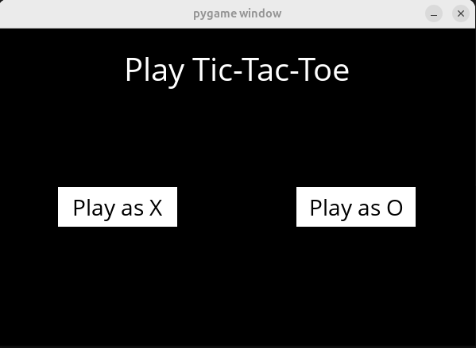

# Tic-Tac-Toe Intelligent Bot Player 🎮🤖

A simple Tic-Tac-Toe game with an unbeatable (well, not always) AI!  
Built using Python and [Pygame](https://www.pygame.org/), this project is a hands-on application of the **Minimax algorithm** with a graphical user interface.

---

## 🧰 Requirements

Before starting, make sure you have:
- Python 3.6+
- Pygame
- (Recommended) A virtual environment for Python

---

## Setup Instructions (Linux)
### 1. Create and activate a Python virtual environment

```bash
python3 -m venv venv
source venv/bin/activate
```
### 2. Install Pygame
```bash
pip install pygame
```

### 3. Confirm installation path
To locate where `pygame` is installed (and your active Python environment path) : 
```bash
which python
# or
which python3
```
This path will be used in your IDE (VS Code) configuration later.

### 4. Set the Python interpreter in VS Code
In VS Code : 
* Open Command Palette (`Ctrl+Shift+P`)
* Search : `Python: Select Interpreter`
* Choose the one pointing to your virtual environment that has pygame among the suggestions

---
## Files Overview
* `tictactoe.py` - contains all the logic and AI for the bot
* 'runner.py` - graphical interface using Pygame (already implemented)

---
## Gameplay
When you run `python runner.py`, you will be able to play Tic-Tac-Toe against the AI via a graphical interface. You will be first prompted to choose to be 'X' or 'O'. X will start the game first.
<p float="left">
  
  
</p>

---
## Troubleshooting
* No module named pygame:
Make sure you're in the virtual environment and pygame is installed.

* Game doesn't launch:
Ensure you're running `runner.py` (not `tictactoe.py`), and that your functions are implemented.

* VS Code runs wrong Python version:
Double-check the selected interpreter points to your virtual environment.


