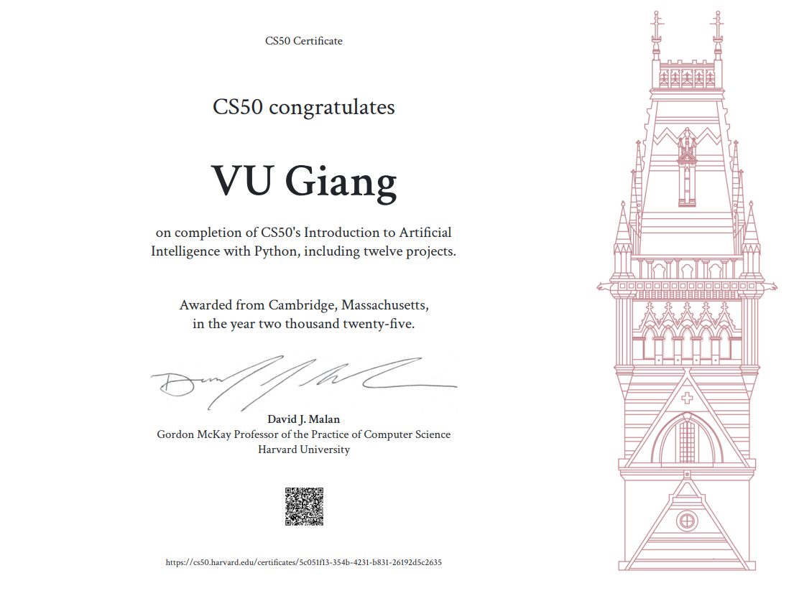

# CS50’s Introduction to Artificial Intelligence with Python – Project Repository
__**Status** : Finished__

Welcome to my project repository for **CS50’s Introduction to Artificial Intelligence with Python** (CS50AI), offered by Harvard University and taught by Brian Yu. This repository showcases my work, implementations, and learning progress throughout the course.
> 🧠 [Course link](https://cs50.harvard.edu/ai/)


## About the Course

CS50AI explores the foundational concepts behind artificial intelligence, including:

0. Search algorithms: Search Problems. Depth-First Search. Breadth-First Search. Greedy Best-First Search. A* Search. Minimax. Alpha-Beta Pruning.
    
1. Knowledge representation and logical inference: Propositional Logic. Entailment. Inference. Model Checking. Resolution. First Order Logic.
    
2. Uncertainty and probabilistic reasoning: Probability. Conditional Probability. Random Variables. Independence. Bayes’ Rule. Joint Probability. Bayesian Networks. Sampling. Markov Models. Hidden Markov Models.

3. Optimization: Local Search. Hill Climbing. Simulated Annealing. Linear Programming. Constraint Satisfaction. Backtracking Search.

4. Machine learning: Supervised Learning. Nearest-Neighbor Classification. Perceptron Learning. Support Vector Machines. Regression. Loss Functions. Overfitting. Regularization. Reinforcement Learning. Markov Decision Processes. Q-Learning. Unsupervised Learning. k-means Clustering.

5. Neural Networks: Artificial Neural Networks. Activation Functions. Gradient Descent. Backpropagation. Overfitting. TensorFlow. Image Convolution. Convolutional Neural Networks. Recurrent Neural Networks.

6. Natural language processing: Syntax. Semantics. Context-Free Grammar. nltk. n-grams. Bag-of-Words Model. Naive Bayes. Word Representation. word2vec. Attention. Transformers.

---
## Files system
* `0-1_degrees` : A graph-based search algorithm to identify the shortest path of connections between two actors using a dataset of movies and people
* `0-2_tictactoe` : An AI bot to beat you in tic-tac-toe using minimax algorithm
* `1-1_knights` : A logical inference AI to solve the Knights and Knaves puzzle by modeling knowledge and applying propositional logic.
* `1-2_minesweeper`: Solve your minesweeper game base using logic inference
* `2-1_pagerank`: Implemented the PageRank algorithm in Python to rank web pages using both sampling and iterative methods.
* `2-2_heredity`: Implemented a Bayesian inference AI in Python to predict genetic traits based on family data.
* `3-1_crossword`: Developed a Python AI to generate crossword puzzles using constraint satisfaction, enforcing node and arc consistency and implementing backtracking search.
* `4-1_shopping`: Developed a Python k-NN model to predict online purchase intent and evaluate accuracy with sensitivity and specificity (from true negatives, true positives, false negatives, false positives).
* `4-2_nim`: Build an AI that learns to play Nim using reinforcement learning (Q-learning).
* `5-1_traffic`: Build a neural network using TensorFlow to classify images of traffic signs from the GTSRB dataset (43 categories).
* `6-1_parser`: Implemented a Python NLP parser using context-free grammars (NLTK) to analyze sentence structure and extract noun phrase chunks from English text.
* `6-2_attention`: Implemented a BERT-based masked language model using Hugging Face Transformers to predict missing words and visualize attention patterns across transformer layers.

---
## How to prepare the environment
* To activate the env: ```source .../cs50_ai_env/bin/activate```
* In CLion : Go to Settings > Project > Add existing interpreter
* Browse the right python file in one of the venv created > bin
---
## Notes
* All projects are implemented individually as part of the CS50AI coursework.
* Some projects include starter code provided by the course; the core logic (especially AI algorithms) is implemented by me.
